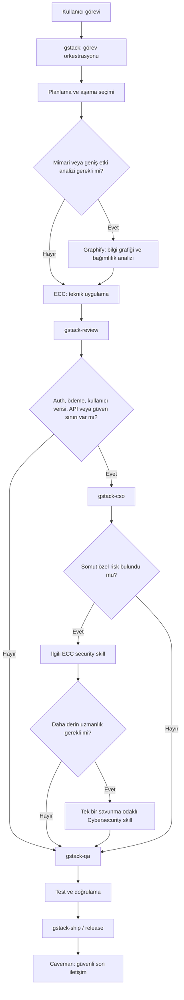

# AI Code Stack

Codex için katmanlı geliştirme, mimari analiz, güvenlik denetimi, kalite kontrolü ve iletişim sistemi.

Bu depo uygulama kodu içermez. Kurulu agent/skill sisteminin hangi bileşenlerden oluştuğunu, bileşenlerin sorumluluklarını ve güvenli çalışma sırasını açıklar.

## Amaç

Sistem beş temel katmanı birlikte kullanır:

1. **gstack** görevin hangi aşamalardan geçeceğini belirler.
2. **ECC** her aşamanın teknik olarak nasıl uygulanacağını belirler.
3. **Graphify** gerektiğinde kod tabanını ve bağımlılıkları haritalar.
4. **Cybersecurity Skills** yalnızca somut ve özel güvenlik risklerinde derin uzmanlık sağlar.
5. **Caveman** teknik içeriği bozmadan son iletişimi kısaltır.

Temel sorumluluk ayrımı:

> gstack **ne zaman**, ECC **nasıl** sorusunu yönetir.

Bu ayrım iki büyük skill sisteminin aynı anda planlama ve orkestrasyon yaparak çakışmasını önler.

## Sistem mimarisi



## Kurulu bileşenler

Denetim tarihi: **17 Temmuz 2026**

| Bileşen | Kaynak | Kurulu skill | Rol |
|---|---|---:|---|
| ECC | [affaan-m/everything-claude-code](https://github.com/affaan-m/everything-claude-code) | 278 | Teknik uzmanlık ve uygulama standartları |
| gstack | [garrytan/gstack](https://github.com/garrytan/gstack) | 54 | Planlama, review, QA ve release orkestrasyonu |
| Graphify | [Graphify-Labs/graphify](https://github.com/Graphify-Labs/graphify) | 1 | Kod tabanı bilgi grafiği ve etki analizi |
| Caveman | [JuliusBrussee/caveman](https://github.com/JuliusBrussee/caveman) | 7 | Son iletişim optimizasyonu |
| Cybersecurity Skills | [mukul975/Anthropic-Cybersecurity-Skills](https://github.com/mukul975/Anthropic-Cybersecurity-Skills) | 115 | Özel risklerde savunma odaklı derin uzmanlık |
| **Toplam** |  | **455 kayıt / 454 benzersiz ad** |  |

Kaynak Cybersecurity deposundaki 817 skill’in tamamı kurulmamıştır. Normal ürün geliştirmeye uygun 115 savunma skill’i seçilmiştir. Exploit, phishing, credential access, malware, persistence, evasion, lateral movement ve command-and-control odaklı skill’ler otomatik çalışma yüzeyine alınmamıştır.

## Katmanların görevleri

### 1. gstack: görev orkestrasyonu

gstack görevin hangi sırayla ilerleyeceğini yönetir:

- Ürün fikrini ve kapsamı sorgulama
- Office hours
- Autoplan
- CEO, engineering, design ve developer-experience plan review
- Hata araştırması
- Code review
- Design review
- QA
- CSO güvenlik denetimi
- Ship, release ve deployment

Örnek yönlendirmeler:

| İhtiyaç | gstack aşaması |
|---|---|
| Belirsiz ürün fikri | `office-hours` |
| Uygulama planı | `autoplan` |
| Mimari plan incelemesi | `plan-eng-review` |
| Kod incelemesi | `review` |
| Güvenlik denetimi | `cso` |
| Tarayıcı ve davranış testi | `qa` |
| Release | `ship` |
| Merge, deploy ve doğrulama | `land-and-deploy` |

gstack teknik framework kararlarının ana kaynağı değildir. Aşamayı seçer; teknik uygulamayı ECC’ye bırakır.

### 2. ECC: teknik uzmanlık

ECC, seçilen gstack aşamasının teknik olarak nasıl gerçekleştirileceğini belirler:

- Framework ve dil bilgisi
- Backend ve frontend kalıpları
- API ve veritabanı tasarımı
- Kod standartları
- Test stratejisi
- Güvenlik kuralları
- Performans
- Hata yönetimi
- Doğrulama
- Araştırma öncelikli geliştirme

ECC normal geliştirme sırasında güvenli varsayımları pasif guardrail olarak uygular. Her küçük görevde ağır güvenlik taraması başlatmaz.

### 3. Graphify: koşullu kod tabanı zekâsı

Graphify her görevde zorunlu değildir. Şu durumlarda kullanılır:

- Büyük kod tabanı
- Mimari keşif
- Modül ve dosya ilişkileri
- Bağımlılık analizi
- Şema ilişkileri
- Çağrı yolları
- Değişiklik etki analizi
- Geniş refactor

Küçük ve açıkça lokal değişikliklerde Graphify atlanır. Hazır bir `graphify-out/graph.json` varsa mimari sorular önce bilgi grafiğine sorulur.

Graphify çalışma zamanı denetiminde:

- `graphify 0.9.17` çalışıyordu.
- `graphify-mcp` binary’si çalışıyordu.
- Paralel extraction için Codex `multi_agent` özelliği açıktı.
- Denetlenen örnek projede Graphify indeksi yoktu.
- Codex MCP sunucu kaydı etkinleştirildi; `graphifyy[mcp]==0.9.17` ile gerçek stdio başlangıcı doğrulandı.

### 4. Cybersecurity Skills: dar kapsamlı uzmanlık

Bu paket ana güvenlik yöneticisi değildir. Ana güvenlik denetimini `gstack-cso` yönetir. Paket yalnızca review veya CSO tarafından belirlenmiş somut bir risk için kullanılır.

Kurulu 115 skill’in dağılımı:

| Alan | Skill |
|---|---:|
| Identity and access management | 33 |
| API security | 18 |
| DevSecOps | 17 |
| Cryptography | 15 |
| Web application security | 15 |
| Supply-chain security | 8 |
| AI security | 4 |
| Application security | 2 |
| Privacy compliance | 2 |
| Data protection | 1 |

Kullanım ilkesi:

```text
Önce gstack-cso bulgusu
Sonra ilgili ECC security skill'i
Yalnız ek derinlik gerekiyorsa tek Cybersecurity skill'i
```

Bu sıra aşırı kapsamı, yanlış pozitifleri, tekrar eden taramaları ve gereksiz token tüketimini azaltır.

### 5. Caveman: yalnızca iletişim

Caveman bir karar verici veya orkestratör değildir. Son çıktıda gereksiz tekrarları azaltabilir.

Korunması zorunlu içerikler:

- Kod
- Komutlar
- Dosya yolları
- Hata mesajları
- Güvenlik bulguları
- Test ve doğrulama kanıtları
- Riskler ve engeller
- Tasarım gerekçeleri

Güvenlik uyarılarında veya işlem sırasının yanlış anlaşılabileceği durumlarda sıkıştırma bırakılır ve açık anlatım kullanılır.

## Standart geliştirme akışı

```text
Görevi gstack sınıflandırır
→ gerekiyorsa office-hours veya autoplan
→ büyük mimari/etki analizi gerekiyorsa Graphify
→ ECC teknik uygulama skill'leri
→ gstack-review
→ riskli alan varsa gstack-cso
→ somut riskte ilgili ECC security skill'i
→ gerekirse tek Cybersecurity skill'i
→ gstack-qa
→ test ve doğrulama
→ gstack-ship / release
→ Caveman ile güvenli final iletişim
```

## Güvenlik protokolü

### Normal geliştirme

ECC güvenlik kuralları pasif guardrail olarak çalışır. Secure defaults, input validation, secret yönetimi ve güvenli framework kalıpları uygulama sırasında korunur.

### Kod tamamlandığında

`gstack-review` çalışır. Kod farkı, test kapsamı, veri güvenliği ve yapısal problemler incelenir.

### Yüksek riskli değişiklikler

Aşağıdaki alanlardan biri varsa `gstack-cso` gerekir:

- Authentication
- Authorization
- Ödeme
- Kullanıcı veya hassas veri
- Dosya yükleme
- Dış veya iç API
- Webhook
- Secret
- Yönetici yetkisi
- Yeni güven sınırı

### CSO kapsamı

`gstack-cso` şu alanları denetler:

- Git geçmişinde secret taraması
- Dependency ve supply-chain riski
- CI/CD güvenliği
- Infrastructure ve container güvenliği
- Webhook ve dış entegrasyonlar
- LLM ve agent güvenliği
- Skill supply-chain
- OWASP Top 10
- STRIDE threat model
- Authentication ve authorization
- Input validation
- SQL, command, template ve prompt injection
- Dosya yükleme noktaları
- Rate limiting
- Aktif doğrulama ve yanlış pozitif filtresi

### Release kapısı

Hedef davranış:

```text
Açık CRITICAL veya HIGH güvenlik bulgusu varsa release durur.
Bulgu giderilir veya kullanıcı tarafından açıkça risk kabulü yapılır.
Testler yeniden çalıştırılır.
Yeni doğrulama kanıtı olmadan push yapılmaz.
```

`gstack-ship` içindeki Step 16.5 artık versioned `security-release-gate.sh` dosyasını push öncesinde çalıştırır. Riskli diff için CSO raporu yoksa, rapor okunamıyorsa, raporun diff parmak izi güncel değişikliklerle eşleşmiyorsa veya çözülmemiş `CRITICAL/HIGH` bulgu varsa release hata koduyla durur. Risk sınıflandırması yapılamaması da fail-closed kabul edilir.

## Görev örnekleri

### Küçük UI değişikliği

> Bir butonun boşluğunu ve yazı boyutunu düzelt.

```text
ECC frontend/UI skill
→ lokal doğrulama
→ gerekirse kısa review/QA
```

Graphify, CSO ve Cybersecurity paketi atlanır.

### Büyük macOS tasarım görevi

> macOS için profesyonel bir DAW mixer ekranını yeniden tasarla.

```text
gstack office-hours/autoplan
→ mevcut büyük uygulamaysa Graphify
→ UI/UX
→ Apple HIG
→ Design System
→ Accessibility
→ ECC teknik uygulama
→ gstack-design-review
→ gstack-qa
→ Caveman final iletişim
```

### Backend ve authorization

> JWT tabanlı giriş sistemine rol bazlı yetkilendirme ekle.

```text
gstack-autoplan
→ gerekiyorsa Graphify
→ ECC backend ve framework security
→ uygulama ve testler
→ gstack-review
→ gstack-cso
→ somut JWT/RBAC riskinde ilgili güvenlik skill'i
→ gstack-qa
→ doğrulama
→ release
```

### Kritik ödeme güvenliği

> Ödeme API'si ve webhook doğrulamasını production öncesi denetle.

```text
gstack-cso
→ ECC API/security/test
→ gerekiyorsa Graphify
→ yalnız ilgili Cybersecurity skill'leri
→ replay, signature, idempotency ve rate-limit testleri
→ gstack-qa
→ açık kritik bulgu yoksa release
```

## Denetim sonuçları

### Sağlam alanlar

- Skill junction’ı çalışıyor.
- 455 klasörün tamamında okunabilir `SKILL.md` var.
- Eksik frontmatter yok.
- Bozuk symlink yok.
- Kaynağı belirsiz skill yok.
- ECC, gstack, Caveman ve seçili Cybersecurity skill’leri kaynaklarla dosya hash seviyesinde eşleşiyor.
- Kaynak Git çalışma ağaçları temiz.

### Bilinen eksikler

1. Her proje için otomatik Graphify indeksi bulunmuyor; bu bilinçli olarak koşullu tutuluyor ve yalnız mimari/dependency/impact analizi gerektiğinde oluşturuluyor.
2. Kaynak depolar ile kurulu skill klasörleri canlı bağlı değil; `install.sh` bu nedenle commit-sabitli kopyalama ve doğrulama kullanıyor.
3. Windows PowerShell execution policy nedeniyle `bun` ve `codex` için `.cmd` girişleri gerekebilir.

## Doğrulanan çalışma zamanları

| Araç | Sürüm | Durum |
|---|---|---|
| Codex CLI | `0.143.0` | `.cmd` üzerinden çalışıyor |
| Bun | `1.3.14` | `.cmd` üzerinden çalışıyor |
| Node.js | `v24.18.0` | Çalışıyor |
| Git | `2.54.0.windows.1` | Çalışıyor |
| Graphify | `0.9.17` | Çalışıyor |
| Graphify MCP binary | `0.9.17` + MCP extra | Çalışıyor ve Codex’e bağlı |

## Öncelik kuralları

Çakışma olduğunda:

1. Sistem ve güvenlik kuralları
2. Proje `AGENTS.md` talimatları
3. gstack aşama ve süreç kararı
4. ECC teknik uygulama standardı
5. Graphify kod tabanı kanıtı
6. Özel Cybersecurity uzmanlığı
7. Caveman iletişim optimizasyonu

Graphify bir orkestratör değildir. Cybersecurity paketi ana CSO değildir. Caveman teknik karar vermez.

## Aynı sürümleri kurma

`versions.lock` bütün repository commit’lerini ve çalışma zamanı sürümlerini sabitler. Installer mevcut config ve override dosyalarını değiştirmeden önce otomatik backup alır. Bir komut veya final doğrulama başarısız olursa trap rollback çalışır.

Windows üzerinde Git Bash ile:

```bash
"/c/Program Files/Git/bin/bash.exe" ./install.sh
```

macOS/Linux üzerinde:

```bash
./install.sh
```

Installer:

1. Node, Bun ve Codex sürümlerini doğrular.
2. Eksik kaynak repoları indirir.
3. Her repoyu `versions.lock` commit’ine sabitler.
4. Graphify MCP extra bağımlılığını sabit sürümle kurar.
5. ECC, gstack, Graphify, Caveman ve allowlist içindeki Cybersecurity skill’lerini yerleştirir.
6. Graphify, benchmark ve security gate override’larını idempotent uygular.
7. Global `AGENTS.md` ve MCP config’i yerleştirir.
8. `verify.sh final` geçmeden başarı bildirmez.

## Doğrulama

```bash
./verify.sh final
```

Doğrulanan alanlar:

- Graphify CLI ve MCP binary
- Graphify MCP config
- Toplam skill sayısı
- Duplicate skill adları
- Eksik `SKILL.md`
- Bozuk symlink
- Benchmark routing
- Koşullu Graphify routing
- Security release gate kurulumu
- Global fail-closed politika
- Version manifest
- 115 öğelik Cybersecurity allowlist

Son doğrulama sonucu: **23 PASS, 0 FAIL**.

## Sonuç

Kurulu yapı kullanılabilir durumdadır. En önemli mimari karar, gstack ile ECC’nin sorumluluklarının ayrılmasıdır:

- **gstack:** görev sırası, review, QA ve release
- **ECC:** teknik uygulama, test, güvenlik ve doğrulama yöntemi
- **Graphify:** gerektiğinde kod tabanı kanıtı
- **Cybersecurity Skills:** özel risklerde derin savunma uzmanlığı
- **Caveman:** yalnızca güvenli son iletişim

Bu yapı doğru kullanıldığında yüksek kalite sağlar; bütün skill’lerin her görevde aynı anda çalıştırılması ise kaliteyi artırmak yerine tekrar, çakışma ve token maliyeti yaratır.
